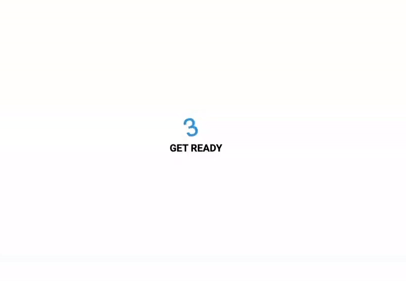

# Animated Countdown

The **Animated Countdown** is a fun and interactive web application that displays a countdown from 3 to 0, with each number rotating as it counts down. Once the countdown reaches 0, a dynamic "GO" message appears along with a replay button, allowing users to restart the animation and experience the excitement all over again.

This project is built using HTML, CSS, and JavaScript, making it easy to integrate and customize according to your preferences. Whether you're looking to add some flair to your website or create an engaging user experience, the Animated Countdown is a great choice.

[Deployed Link]()  

## Features

- Animated countdown from 3 to 0 with rotating numbers.
- Dynamic "GO" message and replay button at the end of the countdown.
- Easy integration into any HTML-based project.
- Customizable styles and animations to match your design.

## Usage

Using the Animated Countdown is straightforward:

1. When you open the application, you will immediately see the countdown starting from 3.
2. The numbers will rotate as they count down, adding a dynamic and engaging visual effect.
3. Once the countdown reaches 0, a "GO" message will appear along with a replay button.
4. Click the replay button to restart the countdown and experience the animation again.

## Customization

You can easily customize the Animated Countdown to match your design and preferences:

- **Styles:** Modify the styles.css file to change the colors, fonts, and overall styling of the countdown.
- **Animations:** Adjust the animations in the styles.css file to create different effects for the rotating numbers and the "GO" message.
- **Message and Button:** You can change the text of the "GO" message and the replay button by editing the index.html file.  

Feel free to experiment with different styles and animations to create a countdown that perfectly fits your project's theme.
